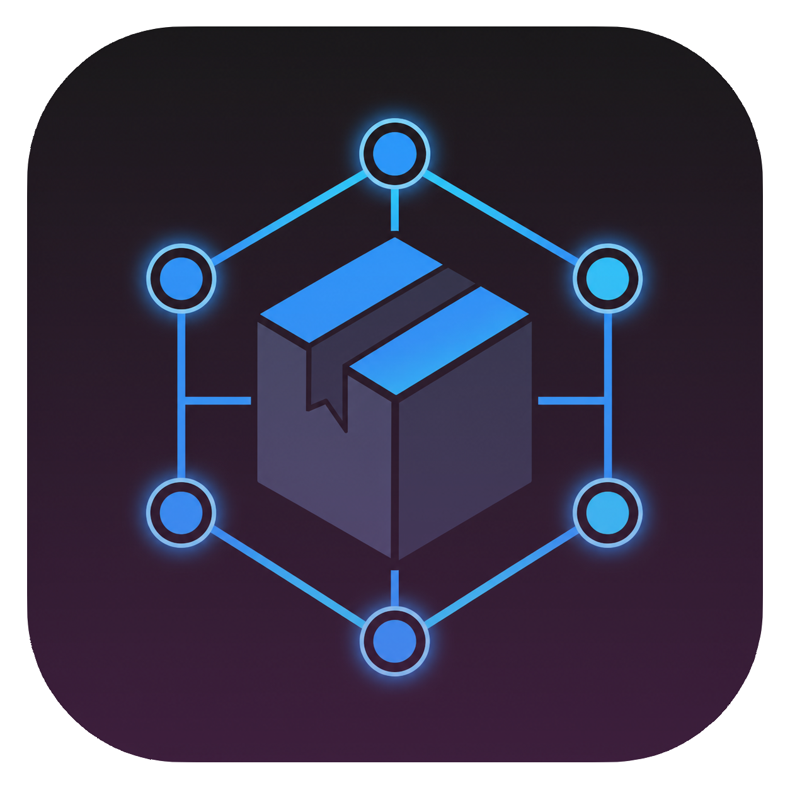

# 🍂 Dependency Viewer

> **Search and add dependencies from 8+ registries — right inside VS Code.**

<div align="center">
  <a href="https://github.com/qewr1324/dependency-viewer">
    
  </a>
  
  <h3>✨ Find, copy, and paste dependencies without leaving your editor ✨</h3>

[](https://github.com/qewr1324/dependency-viewer)
[](LICENSE)
[](#supported-languages--registries)
[](#supported-languages--registries)

[](https://github.com/qewr1324/dependency-viewer/stargazers)
[](https://github.com/qewr1324/dependency-viewer/network/members)
[](https://github.com/qewr1324/dependency-viewer/watchers)

[](https://github.com/qewr1324/dependency-viewer)
[](https://github.com/qewr1324/dependency-viewer)
[](https://github.com/qewr1324/dependency-viewer)

</div>

---

## 🎥 Demo

<div align="center">


</div>

---

## 📖 What is Dependency Viewer?

Dependency Viewer is a **VS Code extension** that lets you search for packages across multiple language registries and get properly formatted dependency strings — ready to paste into your project files.

No more opening browser tabs for Maven Central, npm, NuGet, RubyGems, or crates.io. Just pick your language, search, and copy.

---

## ✨ Features

- 🔍 **Search across 5 package registries** — Maven Central, npm, NuGet, RubyGems, crates.io
- 🌍 **8 languages supported** — Java, JavaScript, TypeScript, C#, Ruby, Rust, Kotlin, Groovy
- 📋 **One-click copy** — formatted dependency string ready to paste
- 🎨 **Syntax highlighting** — XML, JSON, Ruby, TOML with custom highlighter
- ⚡ **Instant search** — debounced input for smooth UX
- 💾 **State persistence** — remembers your last search and results
- 🎯 **Keyboard shortcuts** — `Ctrl+K` to focus search, `Escape` to close

---

## 🎥 Demo Feature

<div align="center">


</div>

---

## 🚀 Supported Languages & Registries

| Language      | Registry      | Format                                             |
| ------------- | ------------- | -------------------------------------------------- |
| ☕ Java       | Maven Central | `<dependency>...</dependency>` (XML)               |
| 💛 JavaScript | npm           | `"package": "^version"`                            |
| 💙 TypeScript | npm (@types)  | `"@types/package": "^version"`                     |
| 🔷 C#         | NuGet Gallery | `<PackageReference Include="..." Version="..." />` |
| 💎 Ruby       | RubyGems      | `gem 'package', '~> version'`                      |
| 🦀 Rust       | crates.io     | `package = "version"`                              |
| 🟣 Kotlin     | Maven Central | `implementation("group:artifact:version")`         |
| ⭐ Groovy     | Maven Central | `implementation 'group:artifact:version'`          |

---

## 📁 Project Structure

```bash
dependency-viewer/
├── 📄 package.json              # VS Code extension manifest
├── 📄 route.json                # Registry API definitions
├── 📄 tsconfig.json             # TypeScript configuration
├── 📁 res/                      # Icons and branding
│   └── 🎨 facet-icon-big.png
├── 📁 src/                      # Extension source code
│   ├── 📄 extension.ts          # Entry point & activation
│   ├── 📄 DependencyPanel.ts    # Webview panel management
│   ├── 📄 searchHandlers.ts     # Registry API handlers
│   ├── 📄 utils.ts              # Route loading utilities
│   └── 📁 panel/                # Webview UI
│       ├── 📄 webview.html      # Panel structure
│       ├── 📄 styles.css        # All styles (CSS variables)
│       └── 📄 main.js           # Search logic & syntax highlighting
└── 📁 dist/                     # Build output
    ├── 📄 extension.cjs
    ├── 📄 route.json
    └── 📁 panel/
```

## 🔧 How It Works

1. **Open** — Click `📦 Dependency Viewer` in the status bar
2. **Select** — Choose a language from the dropdown
3. **Search** — Type a package name (e.g., `spring-boot`, `react`, `serde`)
4. **Copy** — Click "Copy to Clipboard" on any result
5. **Paste!** — Paste directly into your `pom.xml`, `package.json`, `Gemfile`, etc.

### Example: Generating a `pom.xml`

- Click: Java → Maven → 4.0
- Generated: ./pom.xml

### Example: Searching for `spring-boot` in Java

- Search: spring-boot
- Result:
    - `📦 org.springframework.boot:spring-boot-starter-web`
    - `v3.2.0` | `MAVEN CENTRAL`

```xml
  <dependency>
      <groupId>org.springframework.boot</groupId>
      <artifactId>spring-boot-starter-web</artifactId>
      <version>3.2.0</version>
  </dependency>
```

- [📋 Copy to Clipboard]

---

## 🛠️ Development

```bash
# Clone
git clone https://github.com/qewr1324/dependency-viewer.git

# Install dependencies
cd dependency-viewer
bun install

# Build
bun run build

# Run extension in VS Code
# Press F5 in VS Code
```

## Adding a New Registry

#### 1. Add to `route.json`:

```json
{
	"NewLanguage": {
		"registry-name": {
			"name": "Registry Display Name",
			"searchUrl": "https://api.registry.com/search",
			"params": {
				"q": "${query}",
				"limit": "20"
			},
			"parseResponse": {
				"items": "results",
				"version": ["version"],
				"format": "{name}@{version}"
			}
		}
	}
}
```

#### 2. Add search handler in `searchHandlers.ts` (if needed):

```typescript
if (repoName === "registry-name") {
	return await searchCustomRegistry(query, config);
}
```

#### 3. Add syntax highlighting in `main.js` (if needed):

```typescript
function highlightCustomLang(code) {
	// Your custom highlighting logic
}
```

#### 4. Done! The extension will pick it up automatically.

# 🎨 VS Code Integration

- 📊 Status Bar — Quick access button in the status bar
- ⌨️ Keyboard Shortcuts — `Ctrl+K` to focus search, `Escape` to close
- 💾 State Persistence — Remembers your last language, query, and results

# 📝 License

- MIT © [GhurbeSABZI](https://github.com/qewr1324)

# 🤝 Contributing

[](https://github.com/qewr1324/dependency-viewer/issues)
[](https://github.com/qewr1324/dependency-viewer/pulls)
[](https://github.com/qewr1324/dependency-viewer/issues?q=is%3Aissue+is%3Aclosed)
[](https://github.com/qewr1324/dependency-viewer/pulls?q=is%3Apr+is%3Aclosed)

[](https://github.com/qewr1324/dependency-viewer/graphs/contributors)
[](https://github.com/qewr1324/dependency-viewer/commits/main)
[](https://github.com/qewr1324/dependency-viewer/graphs/commit-activity)
[](https://github.com/qewr1324/dependency-viewer)

### Contributions are welcome! Whether it's:

- Adding new registries (PHP Packagist, Go modules, etc.)
- Improving syntax highlighting
- Adding more languages
- Fixing bugs
- Improving documentation

### Check out CONTRIBUTING.md for guidelines.

#### Made with ❤️ for developers who hate switching to the browser.
